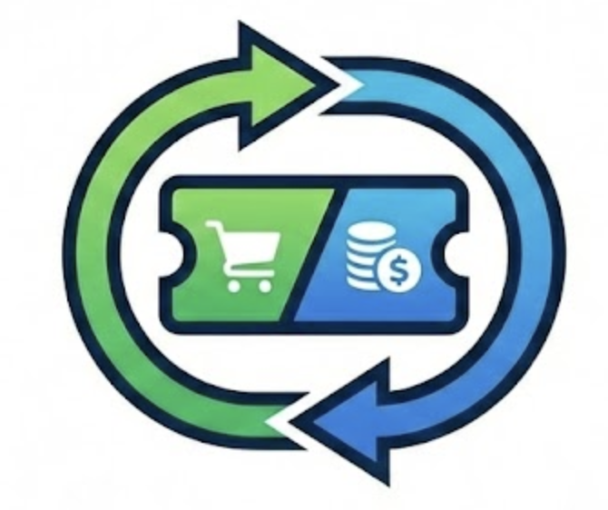

  
  <h1>PromoXchange</h1>

**PromoXchange** is a next-generation decentralized marketplace for trading digital coupons and gift cards. Built on the principles of transparency and security, it empowers users to buy and sell promotional codes directly, powered by the **x402 protocol** and **AI-driven verification**.

---

### 🌐 Live Application
Experience the marketplace at: **[promoxchange.xyz](https://promoxchange.xyz)**

---

### ✨ Core Features

#### 🛡️ AI-Powered Verification
We leverage **Google Gemini Vision AI** to automatically extract and verify coupon details from screenshots. This ensures that every listing is accurate, categorized correctly, and validated against the provided terms.

#### 💸 Seamless x402 Payments
Buying coupons is completely trustless. Transactions are handled via the **x402 protocol**, allowing for direct **USDC** payments between buyers and sellers. No middleman, no extra fees—just pure peer-to-peer commerce.

#### 🔐 Web3 Native Identity
Sign in securely with your wallet using **Sign-In with Ethereum (SIWE)**. We support major wallets including **RainbowKit**, **Porto**, and other EVM-compatible providers for a smooth onboarding experience.

#### 🎫 Ticket-Style Interface
Coupons are displayed in a unique, interactive "ticket" format, making it easy to see brand logos, expiry dates, and categories at a glance.

---

### 🛠️ Built With
*   **Framework**: [Next.js](https://nextjs.org/) (App Router)
*   **Payments**: [x402 Protocol](https://x402.org)
*   **Blockchain**: [Wagmi](https://wagmi.sh/) & [Viem](https://viem.sh/)
*   **AI**: [Google Gemini Pro Vision](https://ai.google.dev/gemini-api)
*   **Database**: [Supabase](https://supabase.com/)
*   **Styling**: [Tailwind CSS](https://tailwindcss.com/)

---

### 🚀 Future Roadmap
*   Support for multiple stablecoins.
*   Enhanced verification mechanisms.
*   Mobile-first Progressive Web App (PWA).

---
© 2026 PromoXchange | Decentralizing the coupon economy.
